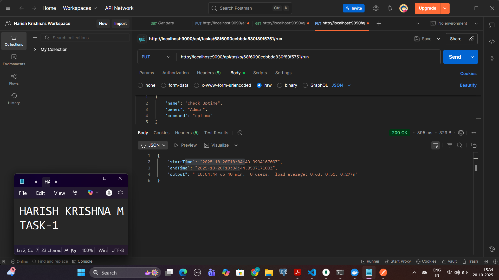
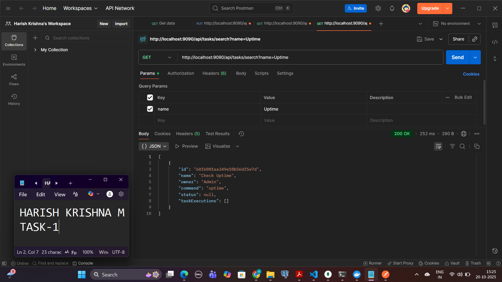

# Task -1 : Java backend and REST API example

This is a Spring Boot application that provides a REST API for creating, managing, and executing shell command "Tasks." It is built with Java 17 and Spring Boot, and it uses MongoDB for data persistence.

The application features a swappable execution model, allowing it to run shell commands either locally on the host machine or by executing them inside a specified Kubernetes pod.

## Features

- **Full CRUD REST API:** Provides endpoints for creating, reading, searching, and deleting tasks.
- **MongoDB Integration:** Stores all tasks and their execution history in a MongoDB database.
- **Dual Execution Model:** Includes two `ExecutorService` implementations:
  - `LocalExecutorService`: Runs commands on the local machine (default).
  - `KubernetesExecutorService`: Runs commands inside a target pod in a Kubernetes cluster (activated via Spring Profile).
- **Command Validation:** A security `CommandValidator` ensures that all submitted commands are checked against a whitelist and do not contain unsafe operators or commands (like `|`, `&&`, `rm`, `sudo`) before saving or running.
- **Execution History:** Automatically records the start time, end time, and full standard output for every command execution.

## Architecture

- **Framework:** Spring Boot 3 / Java 17
- **Database:** Spring Data MongoDB (connects to a MongoDB database).
- **API:** Spring Web (`@RestController`).
- **Kubernetes Integration:** Uses the `fabric8` Kubernetes client.
- **Models:**
  - `Task`: The core object representing a command.
  - `TaskExecution`: A record of a single run of a task.

## Prerequisites

- Java 17 (or newer)
- Apache Maven 3.x+
- A running MongoDB instance
- (Optional) `kubectl` access to a Kubernetes cluster (for testing the `k8s` profile).

## How to Configure

The main configuration is in `src/main/resources/application.yml`.

### 1. Default (Local Execution)

By default, the application is set to run locally. You just need to provide your MongoDB details and server port.

server:
port: 9090 # Or your desired port

spring:
application:
name: taskrunner
data:
mongodb:
uri: mongodb://localhost:27017/taskdb # Your MongoDB connection string
database: taskdb

### 2. Kubernetes Execution

To enable the Kubernetes executor, you must do two things:

1.  **Activate the Profile:** In your `application.yml`, add the `k8s` profile and the required pod details.

    spring:
    profiles:
    active: k8s # Activates the @Profile("k8s")

    task:
    k8s:
    namespace: "default"
    pod: "my-execution-pod" # MUST be a real, running pod name
    container: "my-container" # Optional: only if your pod has multiple containers

2.  **Change the Code:** In `TaskService.java`, change the `@Qualifier` in the constructor to inject the Kubernetes service.
    - **From:** `@Qualifier("localExecutor")`
    - **To:** `@Qualifier("k8sExecutor")`

## How to Run

1.  Clone the repository.
2.  Navigate to the project's root directory.
3.  Run the application using the Maven wrapper:
    ./mvnw spring-boot:run - for linux and mac
    mvnw.cmd spring-boot:run - for windows
4.  The API will be available at `http://localhost:9090`.

## API Endpoints

Here is a list of all available API endpoints.

| Method | Endpoint | Description |
| `GET` | `/api/tasks` | Returns a JSON array of all tasks in the database. |
| `GET` | `/api/tasks?id={id}` | Returns a single `Task` object by its ID. Returns 404 if not found. |
| `PUT` | `/api/tasks` | Creates a new task or updates an existing one if the `id` is provided. The `command` is validated before saving. |
| `DELETE` | `/api/tasks/{id}` | Deletes a task by its ID. |
| `GET` | `/api/tasks/search?name={name}` | Searches for tasks where the `name` field contains the query string (case-insensitive). Returns 404 if no tasks are found. |
| `PUT` | `/api/tasks/{id}/run` | Executes the task's command. This creates a new `TaskExecution` object and adds it to the task's `taskExecutions` list. |

## Usage Examples (Postman / cURL)

## here in this case i used postman

Here are examples of API requests.

### 1. Create a Task

This will create a new task. Remember to copy the id from the response for later steps.
Method: PUT
URL: http://localhost:9090/api/tasks
Body: raw (JSON)
{
"name": "Check Uptime",
"owner": "Admin",
"command": "uptime"
}
**Request and Response:**

### 2. Get All Tasks

This returns a list of all tasks in the database.
Method: GET
URL: http://localhost:9090/api/tasks
**Request and Response:**

### 3. Run a Task

This executes the task's command. Use the id you copied from Step 1.
Method: PUT
URL: http://localhost:9090/api/tasks/{id}/run (Replace {id} with your actual task ID)
**Request and Response:**

### 4. Search for a Task by Name

This finds tasks whose name contains the query string.
Method: GET
URL: http://localhost:9090/api/tasks/search?name=Uptime

### 5. Get Task by ID (to see history)

This fetches the full task object, including its taskExecutions list. Use the id from Step 1.
Method: GET
URL: http://localhost:9090/api/tasks?id={id} (Replace {id} with your actual task ID)
**Request and Response:**
`

### 6. Delete a Task

This deletes the task from the database. Use the id from Step 1.
Method: DELETE
URL: http://localhost:9090/api/tasks/{id} (Replace {id} with your actual task ID)
(The response will be empty with a `204 No Content` status)

